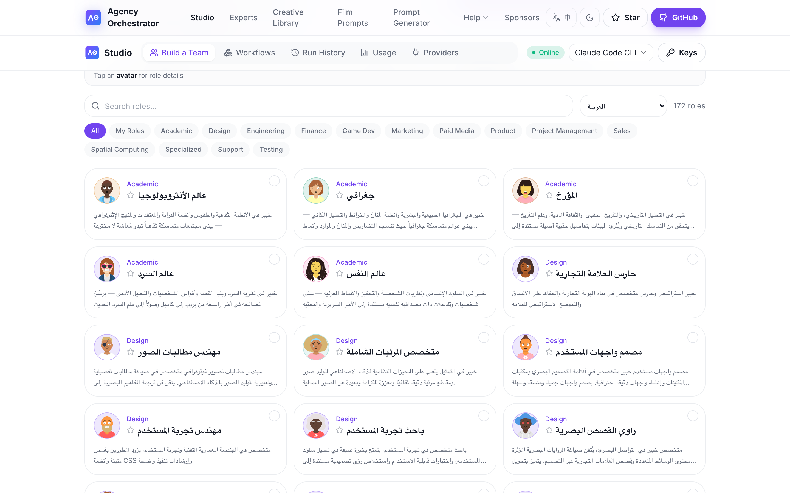

<div dir="rtl">

# agency-agents بالعربية (فريق خبراء الذكاء الاصطناعي)

🌐 **العربية** | [English (upstream)](https://github.com/msitarzewski/agency-agents) | [简体中文](https://github.com/jnMetaCode/agency-agents-zh) | [한국어](https://github.com/jnMetaCode/agency-agents-ko) | [Português (BR)](https://github.com/jnMetaCode/agency-agents-pt-BR) | [Русский](https://github.com/jnMetaCode/agency-agents-ru) | [Bahasa Indonesia](https://github.com/jnMetaCode/agency-agents-id)

> **187 شخصية ذكاء اصطناعي جاهزة للاستخدام** — تغطي الهندسة، التصميم، التسويق، المنتج، الألعاب، الأمان، المالية، و 18 قسماً آخر. ليست قوالب prompt عامة: كل وكيل له شخصيته الخاصة، سير العمل المهني، ومخرجات محددة. يدعم Claude Code و Cursor و Copilot و 17 أداة ذكاء اصطناعي للبرمجة.

النسخة العربية المجتمعية لـ [agency-agents](https://github.com/msitarzewski/agency-agents). ترجمة كاملة لـ 184 وكيل من المصدر الأصلي. **PRs مرحب بها** للوكلاء الخاصين بالسوق العربي (Snapchat MENA, Noon, Talabat, Careem, STC, إلخ.).

[](https://github.com/jnMetaCode/agency-agents-ar)
[](https://opensource.org/licenses/MIT)
[](https://makeapullrequest.com)
[](https://www.npmjs.com/package/agency-agents-ar)

> 📖 **دورات مجانية** → [Learn AI Coding](https://aiolaola.com/en?utm_source=github&utm_campaign=agents-ar)(180 درسًا) + [Build AI Agents](https://aiolaola.com/en/course/agents?utm_source=github&utm_campaign=agents-ar)(40 درسًا) — دورات عملية بالإنجليزية


### 📊 حجم المشروع

| 🤖 وكلاء AI | 🌏 ترجمة المصدر | 🇸🇦 أصلي عربي | 🧠 أدوات | 🏢 أقسام |
|:---:|:---:|:---:|:---:|:---:|
| **187** | **184** | **3** | **17** | **18** |

---

## 🚀 Agency Orchestrator — شغّل مكتبة الشخصيات فعلياً

> **💡 جملة واحدة، عدة خبراء ذكاء اصطناعي يتعاونون تلقائياً، نتيجة كاملة في دقائق.**
>
> مكتبة الشخصيات توفر الخبراء؛ [**Agency Orchestrator**](https://github.com/jnMetaCode/agency-orchestrator) يجعلهم يعملون كفريق حقيقي.

</div>

```bash
npm install -g agency-orchestrator
ao compose "اكتب تحليلاً عميقاً عن AI Agents" --run
```

<div dir="rtl">

```
🎭 توزيع تلقائي للأدوار → عالم سرديات + عالم نفس + منشئ محتوى + مصمم سردي
📊 توزيع تلقائي → DAG workflow، كشف تلقائي للتبعيات، تنفيذ متوازٍ
✅ تسليم تلقائي → نتيجة كاملة في دقائق
```

| القدرة | الوصف |
|:---|:---|
| 🎯 **تنسيق بدون كود** | لغة طبيعية أو YAML، صف ما تريد في جملة |
| ⚡ **تنفيذ DAG متوازٍ** | كشف تلقائي للتبعيات، الخطوات المستقلة تعمل بالتوازي، السرعة مضاعفة |
| 🔄 **استئناف من نقطة الحفظ** | الخطوة الفاشلة تُعاد بمفردها، لا داعي للبدء من الصفر |
| 🆓 **6 LLMs مجانية** | Claude Code / Gemini CLI / Copilot / Codex / OpenClaw / Ollama |
| 💰 **3 تكاملات API** | DeepSeek / Claude API / OpenAI |
| 📋 **32 قالباً جاهزاً** | تطوير، تسويق، تحليلات، تصميم، عمليات |

<div dir="rtl">

### استخدم هذه المكتبة مباشرة في AO

منشورة أيضاً كحزمة npm (`agency-agents-ar`):

</div>

```bash
npm i agency-agents-ar
```

<div dir="rtl">

في الـ workflow استخدم `agents_dir: "agency-agents-ar"`، أو اختر **العربية** من قائمة المكتبات في صفحة «Build a Team» في Studio:

</div>

أو تصفح الوكلاء الـ 187 مباشرة دون تثبيت: [**ao.aiolaola.com/experts?lib=ar**](https://ao.aiolaola.com/experts?lib=ar)

<p align="center"></p>

---

## ما هذا؟

**مكتبة شخصيات ذكاء اصطناعي جاهزة للاستخدام**. كل وكيل له هوية واضحة، قواعد حرجة، سير عمل، ومخرجات محددة. ركّبها في أداة الذكاء الاصطناعي خاصتك ثم فعّلها بلغة طبيعية.

**الفرق عن الـ prompts العادية**: الـ prompts العادية تقول للذكاء الاصطناعي "أنت خبير"؛ هنا الوكلاء يحددون **كيف يفكر الخبير، كيف يعمل، وماذا يسلّم**. مثلاً [Security Engineer](engineering/engineering-security-engineer.md) يراجع الكود بنداً بنداً وفق OWASP Top 10؛ [Frontend Developer](engineering/engineering-frontend-developer.md) يعيد هيكلة مكونات React وفق ARIA وإمكانية الوصول وميزانية الأداء.

---

## بداية سريعة

### الطريقة 1: تثبيت تلقائي في أداة الذكاء الاصطناعي

يدعم **17 أداة AI للبرمجة**:

</div>

```bash
./scripts/install.sh                       # كشف وتثبيت تلقائي
./scripts/install.sh --tool openclaw       # OpenClaw ⭐ موصى به
./scripts/install.sh --tool claude-code    # Claude Code
./scripts/install.sh --tool copilot        # GitHub Copilot
./scripts/install.sh --tool cursor         # Cursor
# ... و 13 أداة أخرى
```

<div dir="rtl">

> Claude Code و GitHub Copilot يعملان مباشرة؛ الأدوات الأخرى تحتاج `./scripts/convert.sh` أولاً.

### الطريقة 2: نسخ يدوي

</div>

```bash
cp -r engineering/*.md ~/.claude/agents/
# ثم في Claude Code: "فعّل وضع Frontend Developer وساعدني في بناء مكوّن React"
```

<div dir="rtl">

### الطريقة 3: كمرجع للـ prompt

استعرض [CATALOG.md](CATALOG.md) ثم انسخ/كيّف ما تحتاجه.

---

## قائمة الوكلاء

الكتالوج الكامل لـ 187 وكيل: **[CATALOG.md](CATALOG.md)**. ملخص الأقسام:

| القسم | عدد الوكلاء | أدوار نموذجية |
|------|------------|---------------|
| 🛠️ الهندسة | 29 | Frontend, Backend Architect, AI Engineer, DevOps, Security, SRE, Embedded, FPGA |
| 🎨 التصميم | 8 | UI/UX, Brand Guardian, Image Prompt Engineer, Visual Storyteller |
| 📢 التسويق | 30 | Growth Hacker, Content Creator, SEO, TikTok / Twitter / Instagram |
| 💰 الإعلانات المدفوعة | 7 | تدقيق، Creative Strategist، PPC، Programmatic |
| 💼 المبيعات | 8 | Account Strategist، Sales Coach، MEDDPICC، Outbound |
| 🏦 المالية | 5 | Bookkeeper، FP&A، Investment Researcher، Fraud Detection |
| 📦 المنتج | 5 | PM، Feedback Synthesizer، Trend Researcher |
| 📋 إدارة المشاريع | 6 | Studio Producer، Experiment Tracker، Project Shipper |
| 🧪 الاختبار | 8 | Test Automation، API Tester، Performance Benchmarker |
| 🤝 الدعم | 6 | Incident Communicator، Customer Insights |
| 🔬 تخصصات | 41 | Blockchain Security، SOC 2 / ISO 27001 / HIPAA، Legal Review، Real Estate |
| 🥽 الحوسبة المكانية | 6 | XR User Research، AR/VR Engineer، Haptic Designer |
| 🎮 تطوير الألعاب | 20 | Unity، Unreal، Godot، Roblox، Blender |
| 📖 أكاديمي | 5 | عالم الأنثروبولوجيا، عالم النفس، المؤرخ، عالم السرديات، الجغرافي |

---

## 🇸🇦🇦🇪🇪🇬 وكلاء خاصون بالسوق العربي — PRs Welcome

ترجمة الـ 184 وكيلاً من المصدر اكتملت. PRs مرحب بها للوكلاء التاليين:

- **منصات الشرق الأوسط**: Snapchat MENA، TikTok MENA، X (Twitter) Arabic، Instagram Reels MENA
- **التجارة الإلكترونية**: Noon seller، Amazon.sa/ae، Jumia، Souq، Salla، Zid
- **الخدمات اللوجستية / Super Apps**: Talabat، Careem، Uber MENA، Hungerstation، Mrsool
- **التقنية المالية**: Tabby، Tamara، STC Pay، Apple Pay GCC، Sarie / SAMA regulations
- **الامتثال**: SAMA banking regulations، NCA (Saudi Arabia)، DIFC/ADGM (UAE)، PDPL
- **عمودي**: Halal e-commerce، Saudi Vision 2030 projects، GCC government procurement

التفاصيل في [CONTRIBUTING.md](CONTRIBUTING.md).

---

## سيناريوهات الاستخدام

### السيناريو 1: MVP لإطلاق دولي

**فريقك**:
1. **Frontend Developer** — يبني تطبيق React
2. **Backend Architect** — يصمم API وقاعدة البيانات
3. **Growth Hacker** — يخطط لاكتساب المستخدمين
4. **Rapid Prototyper** — تكرار سريع
5. **Reality Checker** — بوابة جودة قبل الإطلاق

### السيناريو 2: تدقيق أمان + امتثال

**فريقك**:
1. **Security Engineer** — مراجعة الكود وفق OWASP Top 10
2. **Blockchain Security Auditor** (إن وُجد) — تحليل ثغرات العقود الذكية
3. **Compliance Auditor** — فحص SOC 2 / ISO 27001 / HIPAA
4. **Incident Communicator** — إيصال المخاطر إلى الإدارة
5. **Technical Writer** — توثيق تقرير التدقيق

---

## المساهمة

الترجمات، تحسين المحتوى، إضافة وكلاء جدد خاصين بالسوق العربي — كلها مرحب بها. التفاصيل في [CONTRIBUTING.md](CONTRIBUTING.md).

---

## مشاريع شقيقة

| المشروع | التموضع | ملخص |
|---------|---------|------|
| **هذا المشروع** (agency-agents-ar) | 🎭 مكتبة شخصيات بالعربية | 187 خبير AI **جاهز للاستخدام**، PRs السوق العربي welcome |
| [agency-agents-zh](https://github.com/jnMetaCode/agency-agents-zh)  | 🇨🇳 النسخة الصينية | 215 وكيلاً (165 ترجمة + 50 أصلي للسوق الصيني) |
| [agency-agents-ko](https://github.com/jnMetaCode/agency-agents-ko) | 🇰🇷 النسخة الكورية | 187 وكيلاً مترجماً |
| [agency-agents-pt-BR](https://github.com/jnMetaCode/agency-agents-pt-BR) | 🇧🇷 النسخة البرازيلية | 187 وكيلاً مترجماً |
| [agency-agents-ru](https://github.com/jnMetaCode/agency-agents-ru) | 🇷🇺 النسخة الروسية | 187 وكيلاً مترجماً |
| [agency-agents-id](https://github.com/jnMetaCode/agency-agents-id) | 🇮🇩 النسخة الإندونيسية | 187 وكيلاً مترجماً |
| [agency-agents](https://github.com/msitarzewski/agency-agents) | 🌏 الأصلي بالإنجليزية | 184 وكيلاً أصلياً |
| [agency-orchestrator](https://github.com/jnMetaCode/agency-orchestrator) | 🚀 محرك التنسيق | جملة واحدة → 187 خبير يتعاونون، **نتائج في دقائق** |

---

## شكر وتقدير

- النسخة الإنجليزية الأصلية: [msitarzewski/agency-agents](https://github.com/msitarzewski/agency-agents) (رخصة MIT)
- شكراً للمؤلف الأصلي [@msitarzewski](https://github.com/msitarzewski) على هذا المشروع الرائع
- الترجمة العربية تمت بشكل دفعي عبر Claude Sonnet مع مراجعة عينات تمثيلية. PR لتحسين الأسلوب مرحب بها دائماً.

---

## الرخصة

MIT License — استخدام تجاري أو شخصي بحرية.

---

<div align="center">

**187 شخصية AI، دعم 17 أداة، plug-and-play**

[⭐ ضع نجمة](https://github.com/jnMetaCode/agency-agents-ar) · [افتح Issue](https://github.com/jnMetaCode/agency-agents-ar/issues) · [ساهم](https://github.com/jnMetaCode/agency-agents-ar/pulls)

مبني على [agency-agents](https://github.com/msitarzewski/agency-agents)، مُترجم ومُحلّى للسوق العربي

</div>

</div>
